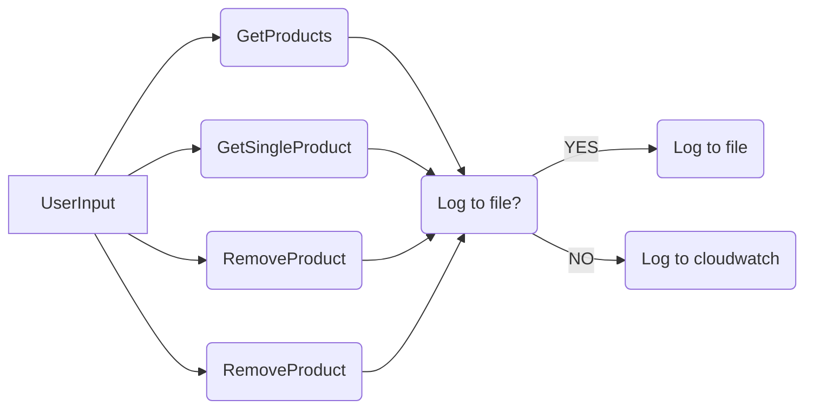
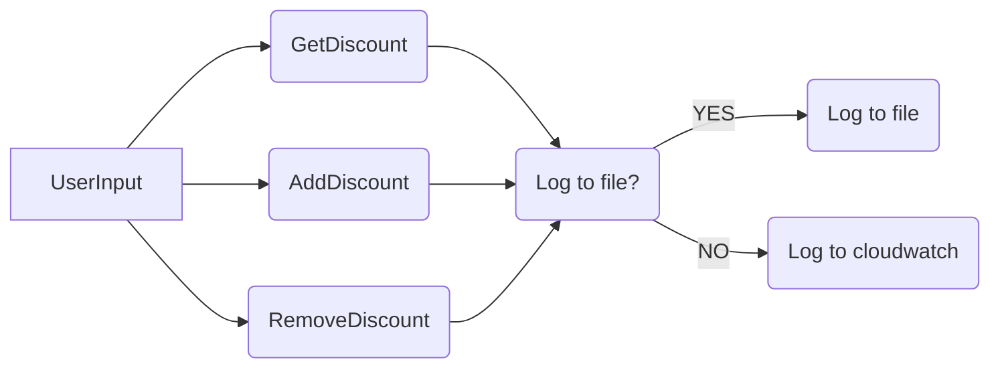
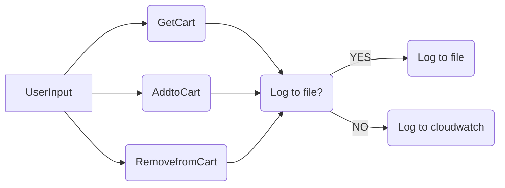

# Simple Store 

Demo store to showcase logging to a file and to cloudwatch

## Table of contents

- [Product Module](#product-module)
- [Discount Module](#discount-module)
- [Cart Module](#cart-module)
- [Requirements](#requirements)

### Product Module:
We do the following actions on the product class: add, remove, fetch all produts and add a single product.

```json
// Sample product:
 {
        "productid": 1,
        "name": "mouse",
        "description": "Wireless and has rgb",
        "price": 4000,
        "stockquantity": 30
},
```


### Discount Module:
We do the following actions on the discount class: add, remove, fetch all discounts

```json
// Sample discount:
{
    "name": "20% Off select items",
    "productid": 1,
    "discountpercentage": 20,
    "discountcode": "20FOR20"
},
```



### Cart Module:
We do the following actions on the cart class: add, remove, fetch all cart items

```json
// Sample cart:
{
    "productid": 4,
    "quantity": 10,
    "totalprice": 2000,
    "discountcodes": "50OFFERNOW",
    "date": "August 11, 2022"
},
```
    


### Requirements
- [Requirements.txt](requirements.txt) file contains all the packages that were used in creating of the blockchain and the api
